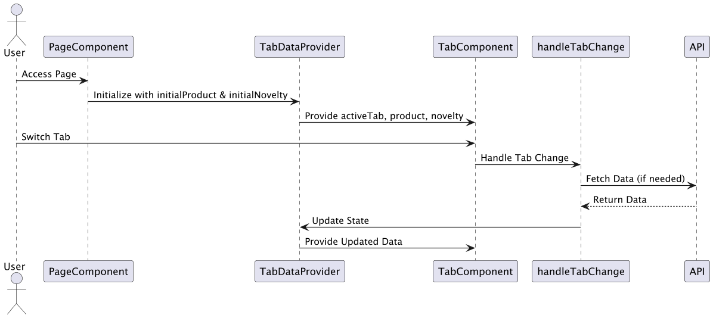
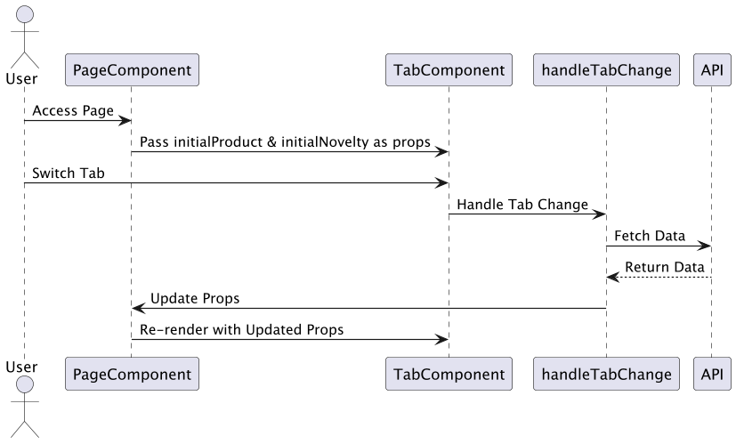

## TabDataProvider の利点と `props` との違い

`TabDataProvider` を使用する利点を説明し、その処理フローを図で示します。また、`props` を用いて `TabComponent` にデータを渡す場合との違いも比較します。

---

### **`TabDataProvider` の利点**

1. **コンテキストによる状態管理**  
   `TabDataProvider` を使うと、データ (`product`, `novelty`, `activeTab` など) とその状態管理関数を一箇所で管理できます。これにより、状態が他の子コンポーネントでも簡単に共有されます。

2. **再取得の柔軟性**  
   - `handleTabChange` 内で必要なデータだけを取得して更新できます。
   - `props` のみを使う場合、データの更新は親コンポーネントで行う必要があり、親から子へのデータの再バインディングが発生します。

3. **再レンダリングの最適化**  
   - コンテキストを使用することで、特定の状態変更 (`product` や `novelty`) によって影響を受けるコンポーネントのみ再レンダリングされます。
   - 一方、`props` を使用すると、親コンポーネント全体が再レンダリングされる可能性があります。

4. **コードのモジュール化とテストのしやすさ**  
   - 状態管理を `TabDataProvider` に分離することで、ビジネスロジックとUIが分離されます。テストや保守が容易になります。

---

### **`props` を使う場合の違い**

#### **`props` の場合の特徴**
- 初期データは親コンポーネント (`Page`) から渡されます。
- `handleTabChange` の処理は `TabComponent` 内で完結できますが、状態の変更やデータの再取得は親コンポーネント側でも管理する必要があります。
- 状態管理が分散し、複雑になりやすい。

---

### **処理フロー図**

# 処理フロー説明

## 1. Provider パターン
以下は `TabDataProvider` を使用した場合の処理フローです。

## 2. Props パターン
以下は `props` を使用した場合の処理フローです。

